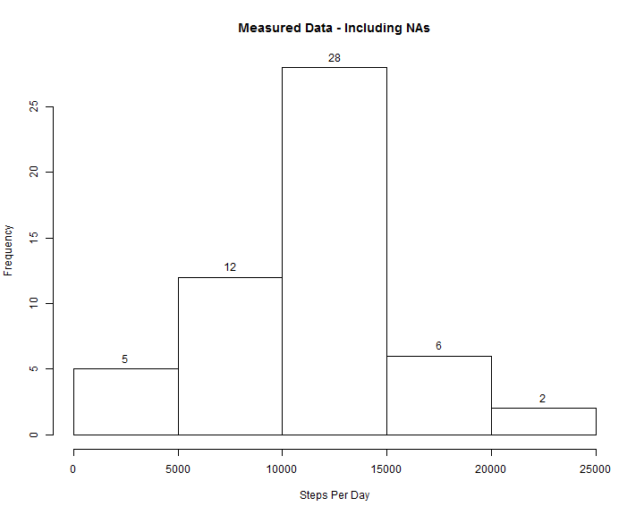
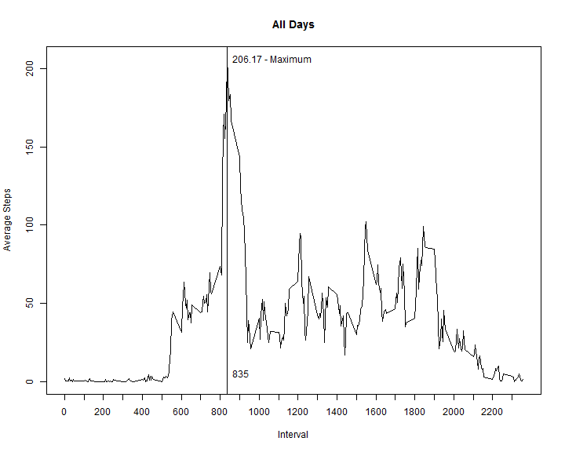
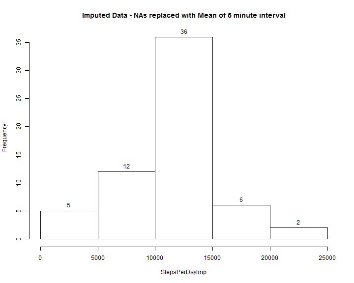
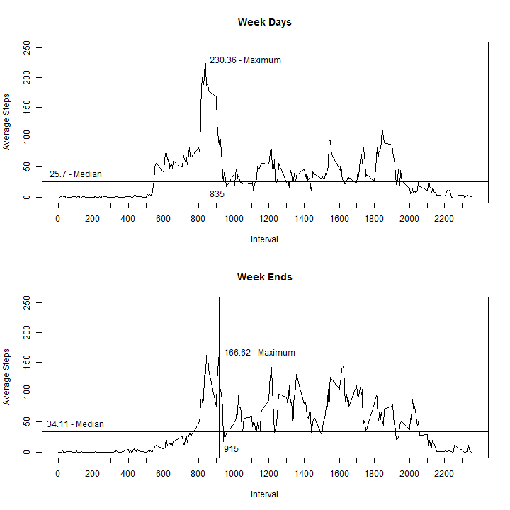

#LOAD AND PREPROCESS THE DATA

Read Measured Data from csv file and convert date string to R date type

```r
# read Measured activity data
actMea <- read.csv("~/R/activity.csv")

## convert date string to R date type
actMea$date <- as.Date(actMea$date)
## create interval array for later use
intervals <- unique(actMea$interval)
```


#WHAT IS MEAN TOTAL NUMBER OF STEPS TAKEN PER DAY?

Calculate the total number of steps taken per day and plot histogram of Measured Data

```r
# sum steps per day for Measured data
perDayMea <- tapply(actMea$steps, actMea$date, FUN = sum)

# plot histogram
par(mfrow=c(1,1))
metaHist <- hist(perDayMea, main="Measured Data - Including NAs")
for (i in 1:length(metaHist$mids)){
    text(x=metaHist$mids[i],y=metaHist$counts[i],toString(metaHist$counts[i]), pos=3)
}
```

 

Calculate and report mean/median Steps Per Day and report results

```r
# calculate mean and median of Steps per Day for Measured Data and report results
menStepsMea <- mean(perDayMea, na.rm = TRUE)
medStepsMea <- median(perDayMea, na.rm = TRUE)
print(paste("Mean StepsPerDay  : ", toString(menStepsMea)))
```

```
## [1] "Mean StepsPerDay  :  10766.1886792453"
```

```r
print(paste("Median StepsPerDay: ", toString(medStepsMea)))
```

```
## [1] "Median StepsPerDay:  10765"
```


#WHAT IS THE AVERAGE DAILY ACTIVITY PATTERN?

Plot daily activity pattern with plot type = "l"

```r
# create data frame with average number of steps per interval
df <- data.frame(interval = intervals, avgStepsIntv = numeric(length(intervals)))
df$avgStepsIntv <- as.data.frame(tapply(actMea$steps, actMea$interval, FUN = mean, na.rm = TRUE))[,1]

# determine interval with maximum average steps and maximum average steps value
maxAvgIntvl <- intervals[as.numeric(which.max(df$avgStepsIntv))]
maxAvgSteps <- round(max(df$avgStepsIntv),2)

# Plot daily activity pattern
mTitle = "All Days"
plot(intervals,df$avgStepsIntv, type = "l", main=mTitle, xlab = "Interval", ylab = "Average Steps", xaxt = "n")
axis(1,seq(0,2350,100))
# add vertical line marking maximum interval, and text for max interval and max average steps
abline(v = maxAvgIntvl)
text(x=maxAvgIntvl,y=5,toString(maxAvgIntvl),pos=4)
text(x=maxAvgIntvl,y = maxAvgSteps,paste(toString(maxAvgSteps)," - Maximum", sep=""), pos=4)
```

 

Report which daily interval has the maximum number of steps

```r
# report interval with maximum number of average steps and count of missing values
print(paste("Interval with Maximum Number of Steps:", toString(maxAvgIntvl)))
```

```
## [1] "Interval with Maximum Number of Steps: 835"
```


#IMPUTING MISSING VALUES

Calculate and report the total number of missing values

```r
# calculate and report number of missing values
countNA <- length(which(is.na(actMea$steps)))
print(paste("Count of missing values:", toString(countNA)))
```

```
## [1] "Count of missing values: 2304"
```


Devise a strategy for filling in all of the missing values in the dataset.

STRATEGY: Fill in the missing data by replacing it with integer value of the average of steps for that 5 minute interval

Create a dataset that is equal to the original dataset but with the missing data filled in.

```r
actImp <- actMea # copy measured data
# replace NA with average steps for that 5 minute inverval
for (i in which(is.na(actImp$steps)))
    {
    idx <- which(df$interval == actImp$interval[i])
    actImp$steps[i] <- as.integer(df$avgStepsIntv[idx])
}
```

Make a histogram of the total number of steps taken each day

```r
# plot histogram for imputed data
StepsPerDayImp <- tapply(actImp$steps, actImp$date, FUN = sum)
metaHist <- hist(StepsPerDayImp, main="Imputed Data - NAs replaced with Mean of 5 minute interval")
for (i in 1:length(metaHist$mids)){
    text(x=metaHist$mids[i],y=metaHist$counts[i],toString(metaHist$counts[i]), pos=3)
}
```

 

Calculate and report the mean/median total number of steps taken per day for Imputed Data.

```r
# report mean/median values for imputed data
menStepsImp <- mean(StepsPerDayImp, na.rm = TRUE)
medStepsImp <- median(StepsPerDayImp, na.rm = TRUE)
print(paste("Mean StepsPerDay  : ", toString(mean(StepsPerDayImp, na.rm = TRUE))))
```

```
## [1] "Mean StepsPerDay  :  10749.7704918033"
```

```r
print(paste("Median StepsPerDay: ", toString(median(StepsPerDayImp, na.rm = TRUE))))
```

```
## [1] "Median StepsPerDay:  10641"
```

Do these values differ from the estimates from the first part of the assignment? What is the impact of imputing missing data on the estimates of the total daily number of steps?

The estimated values for the Imputed data are lower than the original estimates. 

```r
diffMean <- menStepsMea - menStepsImp
diffMedn <- medStepsMea - medStepsImp
print(paste("Difference Mean   StepsPerDay: ", toString(diffMean)))
```

```
## [1] "Difference Mean   StepsPerDay:  16.4181874420028"
```

```r
print(paste("Difference Median StepsPerDay: ", toString(diffMedn)))
```

```
## [1] "Difference Median StepsPerDay:  124"
```


#ARE THERE DIFFERENCES IN ACTIVITY PATTERNS BETWEEN WEEKDAYS AND WEEKENDS?

Create a new factor for the Imputed Data

```r
# add weekday/weekend factor to imputed data frame
wkDayEnd <- weekdays(actImp$date)
wkDayEnd[which(wkDayEnd=="Saturday" | wkDayEnd=="Sunday")] <- "weekend"
wkDayEnd[which(wkDayEnd != "weekend")] <- "weekday"
actImp <- cbind(actImp,wkDayEnd)
```

Make a panel plot containing a time series plot (i.e. type = "l") of the 5-minute interval (x-axis) and the average number of steps taken, averaged across all weekday days or weekend days (y-axis)

```r
# plot weekday and weekend data together
par(mfrow=c(2,1))

# Plot daily activity pattern for weekdays
subImp <- subset(actImp, actImp$wkDayEnd == "weekday")
df <- data.frame(interval = intervals, avgStepsIntv = numeric(length(intervals)))
df$avgStepsIntv <- as.data.frame(tapply(subImp$steps, subImp$interval, FUN = mean, na.rm = TRUE))[,1]

hValue <- round(median(df$avgStepsIntv),2)

# determine interval with maximum average steps and maximum average steps value
maxAvgIntvl <- intervals[as.numeric(which.max(df$avgStepsIntv))]
maxAvgSteps     <- round(max(df$avgStepsIntv),2)

mTitle = "Week Days"
plot(intervals,df$avgStepsIntv, type = "l", main=mTitle, ylim=c(0,250), xlab = "Interval", ylab = "Average Steps", xaxt = "n")
axis(1,seq(min(intervals),max(intervals),100))
# add vertical line marking maximum interval
# add horizontal line marking median value
abline(v = maxAvgIntvl, h=hValue)
# add text for max interval value and median value
text(x=100,y=hValue,paste(toString(hValue),"- Median"),pos=3)
text(x=maxAvgIntvl,y=5,toString(maxAvgIntvl),pos=4)
text(x=maxAvgIntvl,y = maxAvgSteps,paste(toString(maxAvgSteps)," - Maximum", sep=""), pos=4)

# Plot daily activity pattern for weekends
subImp <- subset(actImp, actImp$wkDayEnd == "weekend")
df <- data.frame(interval = intervals, avgStepsIntv = numeric(length(intervals)))
df$avgStepsIntv <- as.data.frame(tapply(subImp$steps, subImp$interval, FUN = mean, na.rm = TRUE))[,1]

hValue <- round(median(df$avgStepsIntv),2)

# determine interval with maximum average steps and maximum average steps value
maxAvgIntvl <- intervals[as.numeric(which.max(df$avgStepsIntv))]
maxAvgSteps <- round(max(df$avgStepsIntv),2)

mTitle = "Week Ends"
plot(intervals,df$avgStepsIntv, type = "l", main=mTitle, ylim=c(0,250), xlab = "Interval", ylab = "Average Steps", xaxt = "n")
axis(1,seq(min(intervals),max(intervals),100))
# add vertical line marking maximum interval
# add horizontal line marking median value
abline(v = maxAvgIntvl, h=hValue)
# add text for max interval value and median value
text(x=100,y=hValue,paste(toString(hValue),"- Median"),pos=3)
text(x=maxAvgIntvl,y=5,toString(maxAvgIntvl),pos=4)
text(x=maxAvgIntvl,y = maxAvgSteps,paste(toString(maxAvgSteps)," - Maximum", sep=""), pos=4)
```

 
There is a difference between the weekday and weekend patterns. On the weekend, activity rises later in the morning when compared to the weekday, and remains consistenly higher during the late morning, afternoon and evening hours.
